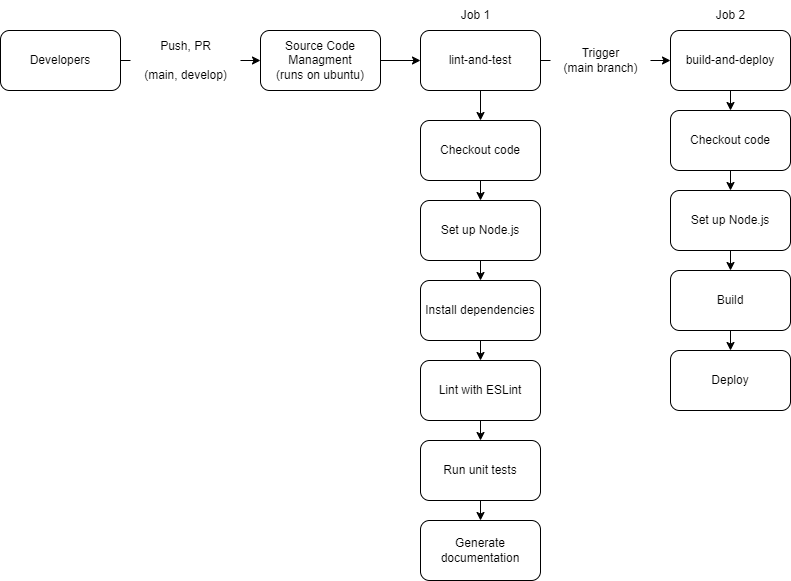

# Phase 1: CI/CD Pipeline Documentation

## Overview
This document provides a comprehensive overview of the Continuous Integration/Continuous Deployment (CI/CD) pipeline for our Developer Journal project. This pipeline facilitates the integration and deployment processes, ensuring that our codebase remains robust and our deployments are seamless.

## Pipeline Configuration
Our CI/CD pipeline is configured to trigger on both push and pull request events to the `main` and `develop` branches. The pipeline consists of two main jobs, executed sequentially to ensure the quality and deployability of our code.

### Workflow Triggers
- **Events**: `push` and `pull_request`
- **Branches**: `main`, `develop`
- **Environment**: Runs on Ubuntu latest version

## Jobs in the Pipeline

### Job 1: Lint and Test
This job focuses on ensuring that the code meets our quality standards and that all unit tests pass successfully.

#### Steps:
1. **Checkout Code**: Pulls the latest code from the repository to run subsequent actions.
2. **Set Up Node.js**: Configures the runner to use a specified version of Node.js.
3. **Install Dependencies**: Runs `npm install` to install all required dependencies.
4. **Lint with ESLint**: Executes ESLint to analyze the code for potential errors and style issues.
5. **Run Unit Tests**: Executes our suite of unit tests to ensure all functionalities work as expected.
6. **Generate Documentation**: Uses JSDoc to automatically generate documentation from the codebase.

### Job 2: Build and Deploy
Once the code is linted and tested, this job handles the building and deployment of the application.

#### Steps:
1. **Checkout Code**: Pulls the latest code that has passed the previous job.
2. **Set Up Node.js**: Ensures that the runner uses the correct version of Node.js.
3. **Build**: Runs a build script to compile the application into a deployable format.
4. **Deploy**: Deploys the built application to the designated hosting service or server.

## Pipeline Diagram
Below is the diagram of our CI/CD pipeline, visually representing the process and steps involved:

## Current Status and Future Enhancements
### Current Status
- The linting, testing, and documentation generation steps are fully functional and have been optimized for performance.
- The build and deployment process is set up and currently undergoing thorough testing to ensure reliability.

### Future Enhancements
- **Code Coverage**: Implement code coverage tools to better understand the effectiveness of our tests.
- **Automated Rollbacks**: Develop mechanisms to automatically rollback deployments if post-deployment tests fail.
- **Performance Monitoring**: Integrate performance monitoring tools to continuously monitor the application in production.

## Conclusion
The CI/CD pipeline designed for the Developer Journal project effectively automates our development and deployment processes, ensuring that we maintain high standards of code quality and reliability in our deployments. We will continue to refine and expand this pipeline to incorporate more features and improve its robustness.

---

This document will be periodically updated as we progress in our project's lifecycle and integrate more features into our pipeline.
