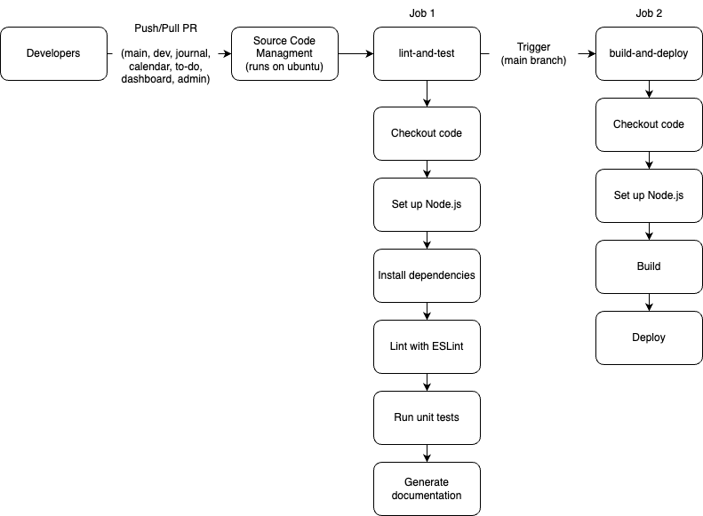

# Phase 2: CI/CD Pipeline Documentation

## Overview

This document provides an updated and comprehensive overview of the Continuous Integration/Continuous Deployment (CI/CD) pipeline for our Developer Journal project. Since we have decided to change the number of branches that are being used to merge into main, it is imperative that we update our pipeline accordingly. We are now having 6 core branches that developers are using to nest branches within. However, for build/deploy we are going to only use the main branch to avoid potential inconsistencies in our deployed environment, especially when using GitHub Pages which generally serves as a single version of the site.

## Pipeline Configuration

Our CI/CD pipeline is configured to trigger on push and pull request events for multiple branches. The pipeline comprises two main jobs executed sequentially to guarantee code quality and deployability.

### Workflow Triggers

- **Events**: `push` and `pull_request`
- **Branches**: `main`, `dev`, `journal`, `calendar`, `to-do`, `dashboard`, `admin`
- **Environment**: Runs on the latest version of Ubuntu

## Jobs in the Pipeline

### Job 1: Lint and Test

This job ensures that the code adheres to our quality standards and that all unit tests pass successfully.

#### Steps:

1. **Checkout Code**: Pulls the latest code from the repository to run subsequent actions.
2. **Set Up Node.js**: Configures the runner to use Node.js version 20.
3. **Install Dependencies**: Runs `npm install` to install all required dependencies.
4. **Lint with ESLint**: Executes ESLint to analyze the code for potential errors and style issues.
5. **Run Unit Tests**: Executes our suite of unit tests to ensure all functionalities work as expected.
6. **Generate Documentation**: Uses JSDoc to automatically generate documentation from the codebase.

### Job 2: Build and Deploy

This job handles the building and deployment of the application, ensuring that only the main branch is deployed to maintain stability.

#### Steps:

1. **Checkout Code**: Pulls the latest code that has passed the previous job.
2. **Setup Pages**: Configures the pages for deployment.
3. **Upload Artifact**: Uploads the entire repository as an artifact for deployment.
4. **Deploy to GitHub Pages**: Deploys the built application to GitHub Pages, but only if the branch is `main`.

## Updated Pipeline Diagram

Below is the updated diagram of our CI/CD pipeline, visually representing the updated process and steps involved:

## Current Status and Future Enhancements

### Current Status

- the linting, testing, and documentation generation steps are fully functional and optimized for performance across all specified branches
- the build and deployment process is now streamlined to deploy only from the main branch rather than developer as well

## Conclusion

The updated CI/CD pipeline for the Developer Journal project effectively automates our development and deployment processes, ensuring high standards of code quality and reliability in our deployments. By focusing deployments solely on the main branch, we maintain a stable and consistent production environment. We will continue to refine and expand this pipeline to incorporate more features and improve its robustness.

---
