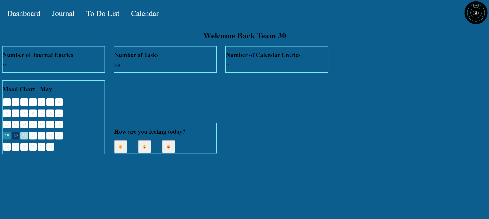

# Standup Meeting Notes

## Meeting Details

- **Date:** 05/20/2024
- **Time:** 17:00
- **Duration:** 
- **Attendees:**
  - Phoebe
  - Kenneth
  - Ali
  - Nathan
  - Andy
  - Umar
- Absent
  - Kabir (out of town)
  - Shravi (has discussion)
  - Sanjith (has another meeting)
  - James (unavailable)

## Agenda
- talk about the assignments due Sunday, May 26th and Sunday, June 9th
- talk about EC videos
- Sprint Progress

## Agile Assignments due sundays
- https://canvas.ucsd.edu/courses/54609/assignments/778821

## EC Video
- phoebe will work on and show team
  
## Updates
Shravi
- i worked on implementing canvas board - the mood reaction widget 
- i have midterm this Thursday so will probably be focusing mostly on that 3. i wanted to know if you wanted to work on the css for the dashboard since you had the images of the icons
- this is what i have rn, it updates the mood according to the day it is
- 
- i havent pushed them yet because there are few PRs pending in the repo and want to push once they are settled so that there r no merge conflicts

Umar
- task - to work on delete button with nathan
- sanjith already kind of had a working delete button 
- waiting for new task

Ali
- finished canvas for journal entries
- looking to pick up new tasks / help out with other people's tasks

Kenneth
- working on add journal. got most of it complete.
- PR and github issue up. recently fixed lint. PR should be ready
- TODO: need people to review it
- sanjith's PR off his branch. might be clocked
- CSS help
- will be testing journal functionality 
  - we should write tests

Andy
- make base template files for todo, journal, and calendar
- linked them to buttons
- wasn't sure if supposed to have assets for the files
- folders for each separate page
- waiting on new tasks

Nathan
- wanted to help pick up delete task but alr figured out
- was a little busy last week.
- looking to get new task going

Phoebe
- Was able to resolve the CI CD pipeline issue
- did research with database. will try to upload documentation by mid this week
- would like developing tasks as well

Sanjith
- I worked on the functionality of the task edit journal, This included the edit button, delete button and save button along with changing the Title of the journal once a title entered.
- I wasn't blocked by anything
- I wanted to know if there is anything else that the edit journal task needed, and if we should make a pr for the branch edit journal

## TODOs
- Phoebe 
  - Review kenneth PR
  - work on documentation for database
  - work on UX for todo
  - help with CSS for journal
  - potentially help with sanjith for testing
- Umar
  - create github issue template
  - work with nathan and andy on todolist 
    - (phoebe will write up accepting criteria)
  - help review sanjith's code
- Ali
  - Help review kenneth PR
  - help kenneth with testing
  - helping with sanjith merging
- Kenneth
  - testin for adding journal
  - helping with sanjith merging
  - CSS for journal 
- Nathan
  - work with Umar and andy on todolist 
    - (phoebe will write up accepting criteria)
- Andy
  - work with Nathan and Umar on todolist 
    - (phoebe will write up accepting criteria)
- Sanjith
  - work on finalizing edit journal and make PR
  - work on unit testing for edit journal
- Shravi
  - [TBD] work with people on unit testing
  - [TBD] join TODO list team
  - [TBD] propose new task
- Kabir
  - [TBD] work with people on unit testing
  - [TBD] join TODO list team
  - [TBD] propose new task
- James
  - [TBD] work with people on unit testing
  - [TBD] join TODO list team
  - [TBD] propose new task