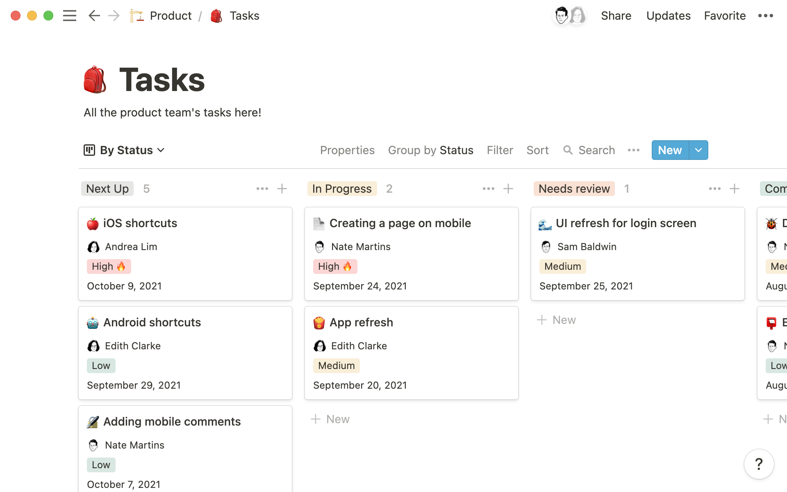
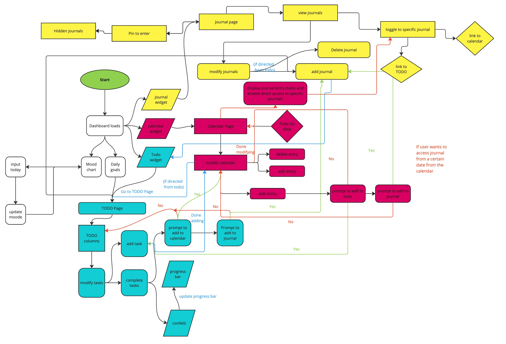

# CSE 110 Project Pitch
## Statement of Purpose
Our software engineering project aims to create a dynamic Developer Journal, catering to the multifaceted requirements of modern developers. The app will serve as a comprehensive platform to track coding activities, project progress, and personal growth in a developer's daily routine. It aims to integrate various aspects of a developer's workflow, including to-do lists, calendars, documentation, and personal reflections, into a single interface. This statement outlines the key features and objectives of our project.

### TO-DO List
The TO-DO list feature of our Developer Journal will facilitate organized task management. Tasks will be structured into "Need to be Done," "Doing," and "Done" columns for clear visualization of progress. Users can assign tags for categorization, enhancing task clarity and organization. Integration of due dates will ensure timely task completion. Upon task completion, users will receive animated feedback, enhancing the user experience. Individual and total completion bars will provide a comprehensive overview of project progress. Subtasks can be added for intricate task management, and progress can be monitored with goal setting and tracking functionalities. Attached below is a picture of the notion TO-DO list board, which inspired us for our project.

### Journal
The Journal feature of our Developer Journal is designed to provide a secure and versatile space for documentation and reflection. Users can opt for PIN access to safeguard sensitive content. It will include a wiki for documentation, featuring favorite libraries, code snippets, and project ideas. A dedicated space will be allocated for recording decisions and reflections on project development. Also, we will integrate feedback forms to allow user input and improvement.
### Calendar
The Calendar module offers comprehensive scheduling, enhancing project organization and planning. Users can manage events such as birthdays, holidays, and deadlines from the TO-DO list. Each calendar event has the option to be linked to the TO-DO List card or developer journal card. This way, the user has an easy way of navigating to more details. Display preferences can be customized for a personalized viewing experience, and interactive elements will enhance user engagement and usability.
### Dashboard Page
The Dashboard serves as the central hub for project management, offering an overview of tasks, documentation, and scheduling. It will consolidate TO-DO list, Journal, and Calendar modules for centralized access. A graphical representation of mood trends over time, with mood-specific music integration, will be provided. Daily goals will be displayed for enhanced productivity and motivation.

In conclusion, our Developer Journal project aims to empower developers with a comprehensive and intuitive toolset for efficient project management. We hope to redefine the standard for developer-centric project management solutions with our tool.

## Proposed Technologies:
Database: PostgreSQL for robust data management

Back-End Framework: Node.js

Front-End: HTML, CSS, and JavaScript

APIs: Integration with GitHub for tracking project changes, Google Calendar for managing deadlines and events, and potentially other APIs for mood music recommendations.

## Topics of Risks
### Data Security and Privacy Risks: 
- Unauthorized access to sensitive personal data due to weak security mechanisms.
Solution: Create a PIN for private journal files
- Risks of data leaks or breaches, particularly if data is stored in the cloud without adequate security measures.
### Performance and Scalability:
- Slow app performance due to heavy data loads, especially with the integration of features like mood tracking graphs.
- Scalability issues as the amount of data grows, which could affect the responsiveness and stability of the app.
### Integration Risks:
- Dependencies on third-party services for features like holiday imports and music for mood tracking, which could lead to disruptions if these services experience downtime or changes in their APIs.
- Difficulties in integrating various features seamlessly, such as syncing calendar events with todos and tracking deadlines effectively.
### Compliance and Legal Risks:
- Potential non-compliance with legal standards related to health data if the mood tracker collects sensitive information.
- Risks related to copyright and intellectual property, especially with user-generated content in the wiki and references sections.
## Rabbit holes
1. Potentially focusing on implementing extra functions instead of core functionality
2. Spending too much time trying to incorporate outside resources like APIs
3. Focusing on adding to many features rather than user accessibility
4. Connecting too many things to each other might get confusing for user and make it complex to implement 
5. Getting distracted with using AI and end up spending more time in debugging rather than learning
6. Increasing complexity without testing the basic features thoroughly
## System Diagrams and Wireframes

## User stories
### User 1 - Middle-aged Principal Software Engineer named Roger
- Roger works as a Principal Software Engineer and is currently working on four different projects. He often responds to slack messages outside of work and looks for ways to document his ideas that come up randomly
- Roger would want the journal to be accessible through different devices because he may not have his laptop with him at all times
- Roger would want to log daily activities and issues, so he can reflect on and improve his coding practices.
- As a developer working on different teams, Roger would like the ability to have team members and managers leave comments and feedback on his development journal entries.
- As a developer, Roger wants to automatically import his code commits as journal entries, so he can have an automatic log of his coding activities.
### User 2 - College student studying computer science named Emily
- Emily is a 3rd-Year CS student at UCSD who has problems with time-management
- As a student, Emily wants to track her educational milestones and resources, so she can see her growth over time
- As a student, Emily wants to keep track of assignments and due dates
- As a student with lots going on, Emily wants to categorize her journal entries by tags (like 'work', 'personal', 'learning'), so she can filter and search entries based on these categories.
- As someone who struggles with deadlines, she wants to set up recurring tasks or goals that remind her daily/weekly/monthly, so she can maintain consistency in her habits and project deliverables.
- As a busy student, she wants to track the time spent on various tasks, so she can analyze her productivity and plan better.
### User 3 - Engineering Manager with a team of 20 named Sapna
- As a project manager, Sapna wants to see a dashboard view of all current projects and their progress, so she can quickly get an overview without opening each project individually.
- As a project manager, Sapna wants to view project progress across multiple team members, so she can manage timelines and distribute resources efficiently.
- As a project manager, Sapna wants to attach files or links to her journal entries, so she can keep all relevant materials together and easily accessible.
- As a manager, I want to add and manage team members within the app, so I can assign tasks and monitor individual contributions directly from the journal.
